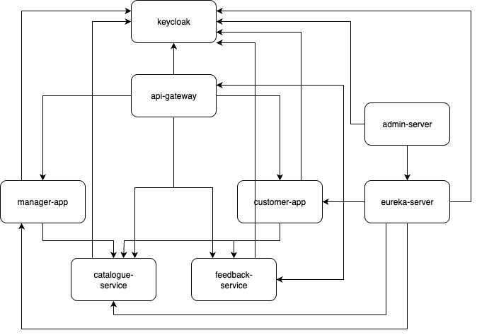
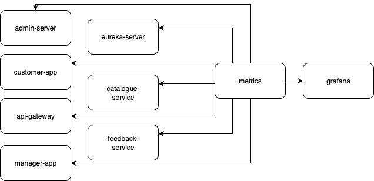
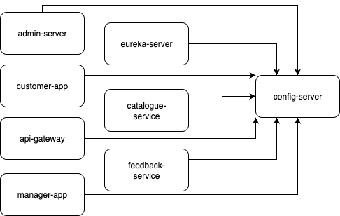

# ministore
Ministore project for development different functionality

# Spring profiles
* standalone – to run the modules `admin-server`, `catalogue-service`, `feedback-service`, `customer-app`, and `manager-app` without Spring Cloud Eureka, Spring Cloud Config, Docker, or Kubernetes.
* cloud – to run the modules `admin-server`, `eureka-server`, `catalogue-service`, `feedback-service`, `customer-app`, and `manager-app` without Spring Cloud Config, Docker, or Kubernetes.
* cloudconfig – to run the modules `admin-server`, `eureka-server`, `catalogue-service`, `feedback-service`, `customer-app`, and `manager-app` without Docker or Kubernetes.
* gateway – to run the modules `catalogue-service`, `feedback-service`, `customer-app`, and `manager-app` behind an API Gateway.
* native – to run the `config-server` module with configurations from a local directory.
* git – to run the `config-server` module with configurations from a Git repository.

# Infrastructure

## Keycloak
The project uses it as an OAuth 2.0/OIDC server for service authorization and user authentication.

```shell
docker run --name ministore-keycloak -p 8082:8080 -e KEYCLOAK_ADMIN=admin -e KEYCLOAK_ADMIN_PASSWORD=admin -v ./config/keycloak/import:/opt/keycloak/data/import quay.io/keycloak/keycloak:23.0.4 start-dev --import-realm
```

## Upload keycloak config to k8s
```shell
kubectl create configmap ministore-keycloak-realm --from-file ./config/keycloak/import/ministore-realm.json -n ministore
```

## MongoDB
The project uses it as a DB for feedback service

```shell
docker run --name feedback-db -p 27017:27017 mongo:7
```

## PostgreSQL
The project uses it as a DB for catalogue service
```shell
docker run --name catalogue-db -p 5433:5432 -e POSTGRES_DB=catalogue -e POSTGRES_USER=postgres -e POSTGRES_PASSWORD=postgres postgres:16 
```

## Victoria metrics
Used in the project to collect service metrics.
```shell
docker run --name ministore-metrics -p 8428:8428 -v ./config/victoria-metrics/promscrape.yml:/promscrape.yml victoriametrics/victoria-metrics:v1.93.12 -promscrape.config=/promscrape.yml
```

## Grafana
Used in the project for visualizing metrics, logs, and traces.
```shell
docker run --name ministore-grafana -p 3000:3000 -v ./data/grafana:/var/lib/grafana -u "$(id -u)" grafana/grafana:10.2.4
```

## Grafana loki
Used in the project as a centralized log storage.
```shell
docker run --name ministore-loki -p 3100:3100 grafana/loki:2.9.4
```

## Grafana tempo
Used in the project as a centralized trace storage.
```shell
docker run --name ministore-tracing -p 3200:3200 -p 9095:9095 -p 4317:4317 -p 4318:4318 -p 9411:9411 -p 14268:14268 -v ./config/tempo/tempo.yml:/etc/tempo.yml grafana/tempo:2.3.1 -config.file=/etc/tempo.yml
```





